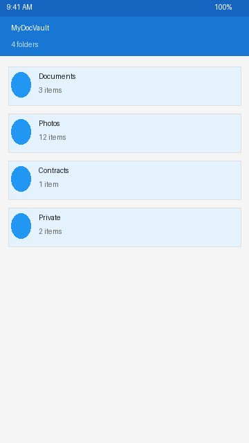
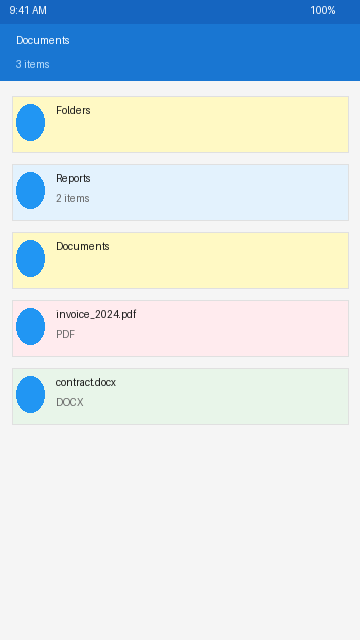
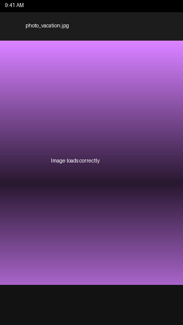
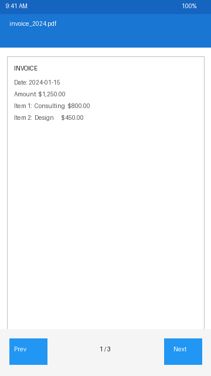
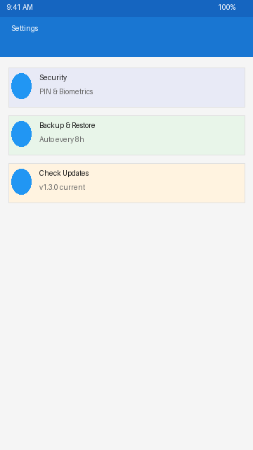

# MyDocVault – Screenshots

These screenshots illustrate the app UI and the fixes applied in v1.3.0.

## 1. Home Screen

Shows the list of vault folders. Each folder is displayed as a card with its name and item count.

## 2. Folder Detail Screen (Fixed Title)

**Fixed in v1.3.0:** The top bar now shows the actual folder name (e.g., "Documents") instead of the static string "Folder".

## 3. Image Viewer (Fixed Loading)

**Fixed in v1.3.0:** Images now load reliably using `File(path)` as the Coil model. A loading spinner is shown while the image decodes, and a broken-image icon is shown on failure (with proper error handling).

## 4. PDF Viewer (Fixed Cancellation Handling)

**Fixed in v1.3.0:** PDF page rendering properly re-throws `CancellationException`, preventing cancelled renders from showing spurious error messages. Page navigation (Prev / Next) is shown when the document has multiple pages.

## 5. Settings Screen

Provides PIN management, biometric toggle, manual backup/restore, and app update checks. Auto-backup runs every 8 hours in the background.
